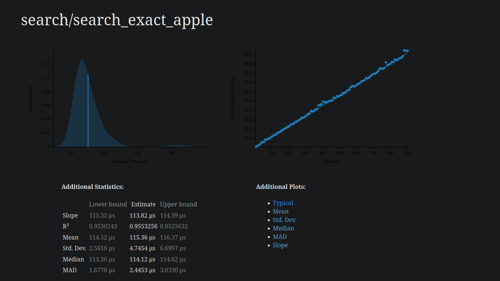
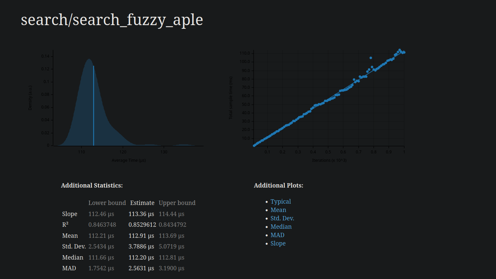
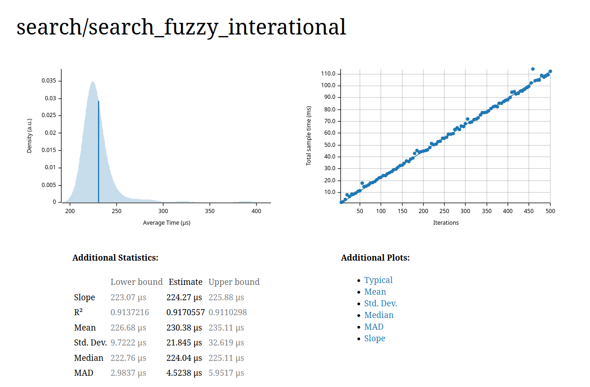

# Fast-FST: High-Performance Fuzzy Search

*A personal experimentation of the `fst` crate for efficient fuzzy searching.*

> **Note:** I'm still learning Rust. This project unexpectedly grew from a simple test script into a complex optimization experiment. The code definitely has bugs and inefficiencies.


## Usage

1.  **Prepare Dictionary**
    Input must be strictly sorted by byte values.
    ```bash
    export LC_ALL=C && sort dict.txt -o dict.txt
    ```
    *Optional: Add weights for ranking (e.g., `love,1000`).*

2.  **Run**
    ```bash
    cargo run --release
    ```
    *   **Type** to search instantly.
    *   **Esc** or **Ctrl+C** to exit.
    *   Note: Always use `--release` for accurate performance.

---

## Benchmarks

Benchmarks tracked using **Criterion.rs** on a local machine.

<details>
<summary>Benchmarking Environment</summary>

- **CPU:** Intel i5-10300H @ 4.5GHz
- **RAM:** 16GB DDR4
- **OS:** Pop!_OS 24.04 LTS
- **Rust Version:** 1.92.0
</details>

### 1. Exact Match (`apple`) - ~113 µs


### 2. Fuzzy Match Short (`aple`) - ~105 µs


### 3. Fuzzy Match Long (`interational`) - ~224 µs


<div align="center">

| Metric | Measurement | Notes |
| :--- | :--- | :--- |
| **Search Latency** | `113µs` - `230µs` | Varies by query length & CPU state |
| **Storage** | `279 KB` (vs `977 KB`) | **71% reduction** in size |
| **Cold Start** | `~3.8µs` | Cached startup (vs `36ms` build) |

</div>

---

## Optimizations

### Heap-Based Top-K Ranking
*   **Problem:** Storing all fuzzy matches in RAM before sorting is `O(N log N)` and memory heavy.
*   **Solution:** Used `std::collections::BinaryHeap` to keep only the top 10 items.
*   **Result:** Complexity drops to `O(N log 10)`.

### Incremental Build System
*   **Problem:** Rebuilding the FST on every run is slow (~350ms).
*   **Solution:** Check file modification times (like `make`). Only rebuild if `dict.txt` is newer than `dict.fst`.
*   **Result:** Startup time improved from **350ms** -> **~8µs** (40,000x speedup).

### Zero-RAM Streaming
*   **Problem:** Loading `Vec<String>` is memory intensive `O(N)`.
*   **Solution:** Stream lines directly from disk into the FST builder.
*   **Result:** Constant RAM usage `O(1)` during construction.

---

## Limitations

*   **Levenshtein Distance > 2:**
    Distance 1 is instant (~200µs). Distance 2 is significantly slower (~1.5ms) due to the exponential growth of states in the automaton, even with heap optimizations.